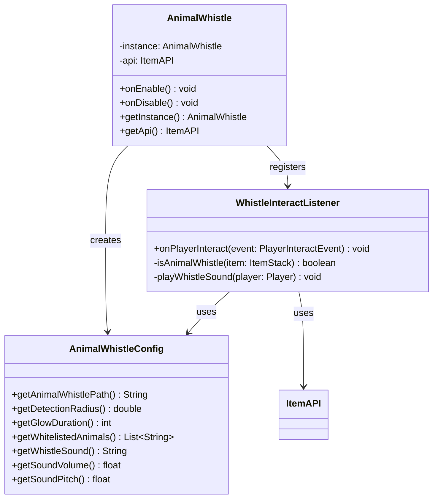

# AnimalWhistle

**A Minecraft server plugin that helps players find their animals — blow a whistle and every nearby horse, donkey, or llama lights up with a glow.**


Built for the [TFMC](https://www.patreon.com/c/TFMCRP) roleplay server, where it runs in production as a quality-of-life tool for finding mounts and pack animals.

---

## What It Does

Right-click with the **Animal Whistle** item and every whitelisted animal within range starts glowing — visible through walls, terrain, and darkness. A whistle sound plays for everyone nearby, and after the configured duration the glow fades on its own.

| | |
|---|---|
| **One-click detection** | Right-click the whistle to scan a configurable radius around the player |
| **Glowing highlight** | Matched animals get the vanilla glowing effect for a configurable duration |
| **Entity whitelist** | Only configured `EntityType`s light up (horses, donkeys, llamas by default); an empty whitelist matches everything |
| **Audible feedback** | Configurable whistle sound, volume, and pitch played at the player's location |
| **Config-driven design** | Item, radius, duration, whitelist, and sound all live in `config.yml` |

## How It Works

The plugin listens for `PlayerInteractEvent` (right-click in air or at a block):

1. The held item is validated against the configured whistle path via the TLibs `ItemAPI` (`isSimilar` against the template item).
2. The whistle sound plays at the player's location in the `AMBIENT` sound category with the configured volume and pitch.
3. All entities within the detection radius are scanned; living entities whose type matches the whitelist (case-insensitive) receive a `GLOWING` potion effect for the configured duration.

No scheduled tasks, no state — everything happens inside the single event handler.

## Architecture

Small, deliberate footprint — each class has one job:

```
src/main/java/tfmc/justin/
├── AnimalWhistle.java                 # Entry point: wiring, lifecycle, ItemAPI setup
├── config/
│   └── AnimalWhistleConfig.java       # config.yml loading: item path, radius, duration, whitelist, sound
└── listeners/
    └── WhistleInteractListener.java   # Right-click → validate item → sound + glow pipeline
```



*Full diagram: [UML-Diagram.mmd](UML-Diagram.mmd)*

### Design decisions

- **Configuration over code** — the item, detection radius, glow duration, animal whitelist, and sound are all YAML edits, not releases.
- **Event-driven, zero scheduling** — the plugin is a single stateless event handler; nothing runs when the whistle isn't being used.
- **Abstraction over item plugins** — the whistle item resolves through the TLibs `ItemAPI`, so one config format covers MMOItems, ItemsAdder, and vanilla items with a one-character prefix.

## Installation

1. Drop `animalwhistle-1.0.0.jar` into your server's `plugins/` folder
2. Install **TLibs** (required). **MMOItems** / **ItemsAdder** are optional item sources
3. Restart the server (or load with PlugManX)
4. Configure `plugins/AnimalWhistle/config.yml` as needed

### Requirements

| Dependency | Required |
|---|---|
| [Paper](https://papermc.io/) 1.21+ | Yes |
| Java 21 | Yes |
| [TLibs](https://www.spigotmc.org/resources/tlibs.127713/) | Yes |
| [MMOItems](https://www.spigotmc.org/resources/mmoitems-premium.39267/) | Optional |
| [ItemsAdder](https://itemsadder.com/) | Optional |

## Usage

1. Obtain the **Animal Whistle** item (via TLibs/MMOItems/ItemsAdder/vanilla)
2. Right-click while holding it — a whistle sound plays
3. All whitelisted animals within the detection radius glow for the configured duration
4. Follow the glowing outlines (visible through walls) to your animals

## Configuration

```yaml
# Item path
items:
  animal-whistle: "m.pets.animal_whistle"
  # Vanilla item example: "v.iron_ingot"
  # ItemsAdder item example: "ia.tfmc.animal_whistle"

# Feature settings
settings:
  detection-radius: 64.0    # Radius in blocks to detect animals
  glow-duration: 5          # Duration in seconds for the glowing effect
  whitelisted-animals:      # Entity types that will be highlighted
    - HORSE
    - DONKEY
    - MULE
    - LLAMA
    - TRADER_LLAMA

# Sound settings
sound:
  type: "ITEM_GOAT_HORN_SOUND_6"
  volume: 4.0               # 1.0 = 16 blocks of range (4.0 = 64 blocks)
  pitch: 2.0                # 0.5 (lower/slower) to 2.0 (higher/faster)
```

| Key | Default | Description |
|---|---|---|
| `items.animal-whistle` | `m.pets.animal_whistle` | Item path for the whistle |
| `settings.detection-radius` | `64.0` | Block radius to scan for animals |
| `settings.glow-duration` | `5` | Seconds the glow effect lasts |
| `settings.whitelisted-animals` | Horses, donkeys, mules, llamas | Bukkit `EntityType` names to highlight (empty list = all animals) |
| `sound.type` | `ITEM_GOAT_HORN_SOUND_6` | Bukkit sound name played on use |
| `sound.volume` | `4.0` | Sound volume (1.0 = 16 blocks of audible range) |
| `sound.pitch` | `2.0` | Sound pitch, 0.5–2.0 |

**Item path formats**

| Source | Format | Example |
|---|---|---|
| MMOItems | `m.category.item_id` | `m.pets.animal_whistle` |
| ItemsAdder | `ia.namespace:item_id` | `ia.tfmc:animal_whistle` |
| Vanilla | `v.material` | `v.iron_ingot` |

## Building from Source

```bash
git clone https://github.com/JustinasLa/animal-whistle.git
cd animal-whistle
mvn package
```

Requires JDK 21 and Maven. The TLibs and MMOItems jars are referenced as local system dependencies — adjust the paths in `pom.xml` to your local copies. The built jar is copied to the project root by the `package` phase.

## Tech Stack

- **Java 21** · **Paper API 1.21.3** · **Maven**
- Bukkit event system, potion effects, and YAML configuration API
- TLibs ItemAPI for cross-plugin item resolution

## Author

**Justinas Launikonis** — [GitHub](https://github.com/JustinasLa) · [Support TFMC](https://www.patreon.com/c/TFMCRP)
